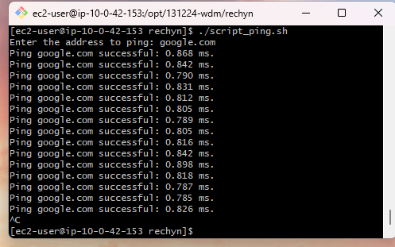
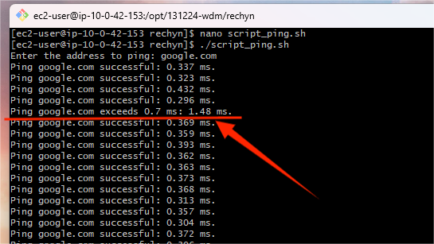

#### Домашнее задание:

Написать скрипт, который будет бесконечно пинговать указанный адрес (переменная или ввод пользователя) с интервалом 1 секунда между попытками. Если время пинга превышает 100 мс или не удается выполнить пинг в течение 3 последовательных отправок пакетов, скрипт просто выведет сообщения об этом.

Работа скрипта:

Работа скрипта если `max_ping_ms=0.7`
