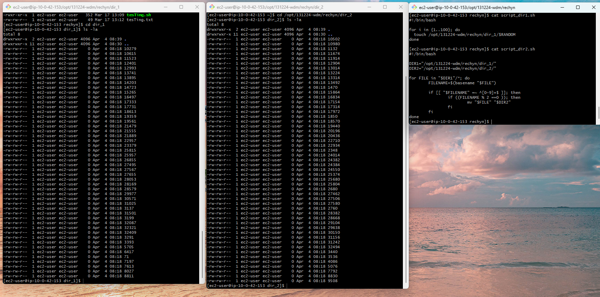

#### Домашнее задание:

1. Создайте на сервере linux.itcareerhub.de в своей папке /opt 2 дополнительных директории. 
2. В первой директории найдите способ (например написав скрипт или выполнив команду в терминале) создать 100 файлов со случайными названиями с использованием $RANDOM. Например файлы  15358 9396 240.
3. Напишите скрипт, который будет переносить в другую директорию файлы, если число, стоящее в названии четное - то перенести файлы в другую директорию, если нет - оставить в текущей. 
4. Пришлите команды или скрипты, с помощью которых Вы выполнили задание.

